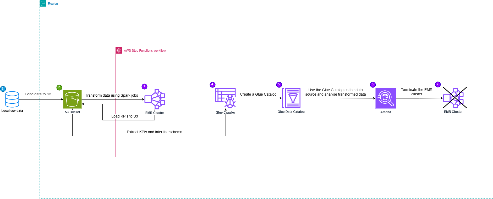

# Car Rental Marketplace Analytics Pipeline Documentation

## Project Overview
This project implements a batch data processing pipeline for a car rental marketplace platform. It leverages AWS services including **EMR (Spark)**, **Glue Crawlers**, **Athena**, and **Step Functions** to compute and analyze business-critical metrics such as vehicle performance, user engagement, and revenue distribution.

---

## Architecture Summary

### AWS Services Used:
- **Amazon S3**: Storage for input and output data.
- **AWS EMR (Spark)**: Executes two Spark jobs for data transformation and metric computation.
- **AWS Glue Crawler**: Crawls processed data and updates the AWS Glue Data Catalog.
- **Amazon Athena**: Runs analytical queries to extract business insights.
- **AWS Step Functions**: Orchestrates the entire workflow.

### **Architecture Diagram**  


---

## Workflow Execution (Step Function)

User manually creates the EMR cluster and provides the **Cluster ID** to the Step Function. The workflow then:
1. Adds Spark steps to the cluster
2. Triggers the Glue crawler
3. Executes Athena queries
4. Terminates the cluster at the end

---

## Input Data
- Location: `s3://car-rental-marketplace/raw-data/`
- Datasets:
  - Vehicles
  - Users
  - Rental Transactions
  - Locations

---

## Spark Jobs

### spark_job_1.py
**Purpose**: Compute vehicle and location performance metrics.
- Metrics: revenue by location, most popular locations

### spark_job_2.py
**Purpose**: Compute user behavior and transaction metrics.
- Metrics: rental durations, spending per user

---

## Glue Crawler
- **Name**: `CarRentalProcessedCrawler`
- **Purpose**: Infer schema of processed data
- **Output**: Tables in AWS Glue Data Catalog under `car_rental_analytics` database

---

## Athena Queries

### 1. Highest Revenue-Generating Location
```sql
SELECT
    pickup_location,
    total_revenue
FROM
    location_metrics
ORDER BY
    total_revenue DESC
LIMIT 1;
```

### 2. Most Rented Vehicle Type
```sql
SELECT
    vehicle_type,
    COUNT(*) AS total_rentals
FROM
    rental_duration_metrics
GROUP BY
    vehicle_type
ORDER BY
    total_rentals DESC
LIMIT 1;
```

### 3. Top-Spending Users
```sql
SELECT
    user_id,
    total_revenue AS total_spent
FROM
    user_metrics
ORDER BY
    total_spent DESC
LIMIT 10;
```

---

## Conclusion

This project successfully built a fully automated data pipeline for the Car Rental Marketplace using AWS services.It answers key questions like top-performing locations, most rented vehicle types, and high-spending users—helping drive smarter decisions.